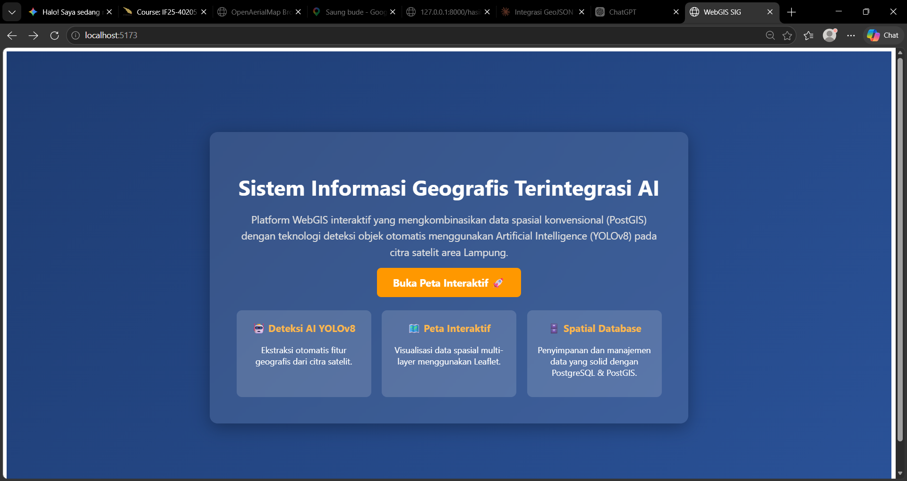
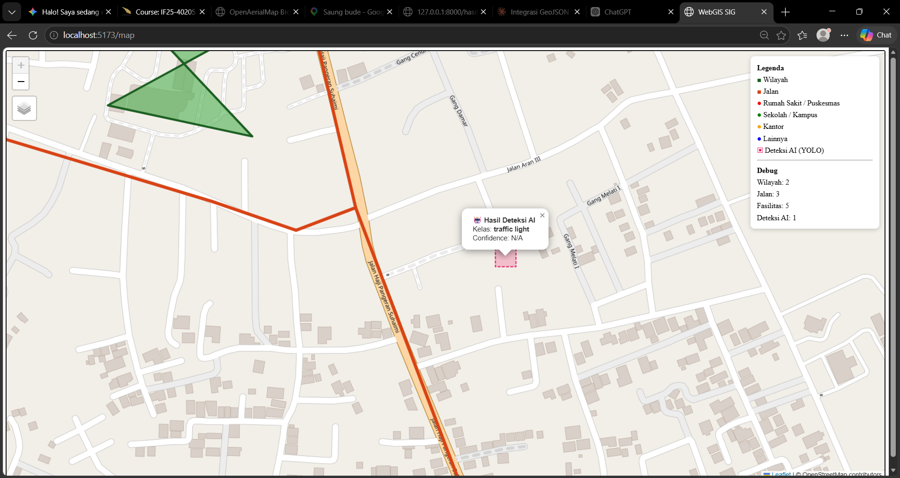
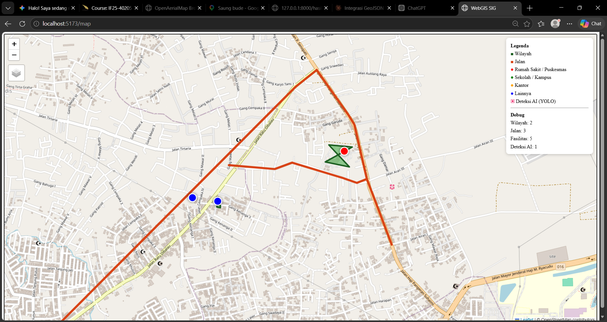

# WebGIS Terintegrasi Deteksi Objek AI (YOLOv8)

Proyek ini adalah Sistem Informasi Geografis (SIG) berbasis Web yang mengintegrasikan deteksi objek AI menggunakan model YOLOv8 dengan tampilan peta interaktif. Sistem ini tidak hanya menampilkan data spasial konvensional dari database, tetapi juga mampu memproses citra udara/satelit, melakukan deteksi objek, dan memetakannya secara otomatis ke dalam koordinat geografis nyata.

## Fitur Utama

- **Deteksi Objek AI (YOLOv8):** Menggunakan model `yolov8n.pt` (*pretrained*) untuk mendeteksi objek pada citra satelit.
- **Image Tiling & Geospatial Processing:** Implementasi teknik *sliding window* (640px) pada citra berukuran besar (Orthophoto/Satelit) agar dapat diproses oleh AI.
- **Auto-Georeferencing:** Konversi otomatis hasil deteksi *bounding box* (piksel) menjadi poligon koordinat geografis (EPSG:4326) menggunakan `rasterio` dan mengekspornya ke format GeoJSON.
- **PostGIS Integration:** Menampilkan layer vektor konvensional (Wilayah, Jalan, Fasilitas Publik) yang ditarik langsung dari database spatial PostgreSQL/PostGIS.
- **Interactive WebGIS:** Dibangun menggunakan React + Leaflet dengan fitur *Layers Control* (toggle layer), *Custom Markers*, pop-up informasi, dan *Basemap toggle* (OSM & Esri Satellite).

## Stack Teknologi

- **Backend:** Python, FastAPI, SQLAlchemy, PostgreSQL + PostGIS, Uvicorn  
- **AI & Geospatial:** YOLOv8 (Ultralytics), Rasterio, GeoPandas, Shapely  
- **Frontend:** React 18 (Vite), react-leaflet v4, Leaflet  
- **GIS Tools:** QGIS (untuk *Georeferencing* awal citra)

## Struktur Direktori

```text
sig-api/
├── data/
│   └── hasil_deteksi.geojson   # Output hasil deteksi YOLO
├── image/                      # Folder tempat menyimpan gambar dokumentasi (.png)
│   ├── 1.png
│   ├── 2.png
│   └── 3.png
├── src/                        # Source code React Frontend
│   ├── App.jsx
│   ├── main.jsx
│   ├── LandingPage.jsx         # Tampilan awal Website
│   ├── LandingPage.css         # Styling tampilan awal
│   └── MapView.jsx             # Komponen peta utama
├── main.py                     # Entry point FastAPI backend
├── database.py                 # Koneksi PostgreSQL
├── auth.py                     # Sistem autentikasi (JWT)
├── schemas.py                  # Pydantic models
├── yolo_pipeline.py            # Script AI & Image Tiling
├── citra_saya.tif              # Citra input yang sudah di-georeferencing (EPSG:4326)
├── yolov8n.pt                  # Pretrained weights model YOLO
├── package.json                # Dependencies React
└── index.html                  # Entry point Vite
```
 📸 Screenshot Hasil

### 1. Tampilan Awal (Landing Page)

**Penjelasan:** Gambar di atas menunjukkan halaman awal (*Landing Page*) aplikasi WebGIS. Halaman ini dirancang sebagai gerbang masuk bagi pengguna, yang menampilkan judul sistem, deskripsi teknologi yang digunakan (YOLOv8, Leaflet, PostGIS), serta tombol navigasi utama "Buka Peta Interaktif" yang mengarahkan pengguna ke halaman peta utama.

### 2. Hasil Deteksi Objek AI (YOLOv8)

**Penjelasan:** Gambar ini menampilkan visualisasi hasil deteksi objek otomatis di atas peta interaktif. Poligon berwarna merah muda dengan garis putus-putus merupakan representasi spasial dari *bounding box* hasil deteksi AI. Saat diklik, poligon tersebut memunculkan *popup* yang menginformasikan klasifikasi objek (dalam contoh ini adalah "traffic light") beserta tingkat kepercayaan model.

### 3. Integrasi Layer Spasial Konvensional (PostGIS)

**Penjelasan:** Gambar ketiga menunjukkan integrasi berbagai layer data spasial yang diambil langsung dari database PostGIS. Terlihat layer jalan (garis oranye), layer wilayah (poligon hijau), serta marker titik untuk fasilitas publik. Di sisi kanan, terdapat panel Legenda untuk keterangan simbol dan panel Debug untuk memantau status pengambilan data dari server secara *real-time*.
```

### Cara Memastikan Gambar Muncul:
1.  Pastikan file ini Anda simpan di folder **`sig-api/README.md`**.
2.  Pastikan Anda memiliki folder bernama **`image`** di dalam folder `sig-api`.
3.  Pastikan di dalam folder `image` tersebut ada file bernama **`1.png`**, **`2.png`**, dan **`3.png`**.

Jika ketiga hal di atas sudah benar, saat Anda membuka folder ini di VS Code dan menekan tombol **Preview** (ikon kaca pembesar di pojok kanan atas), maka semua gambar dan penjelasannya akan muncul dengan rapi.
